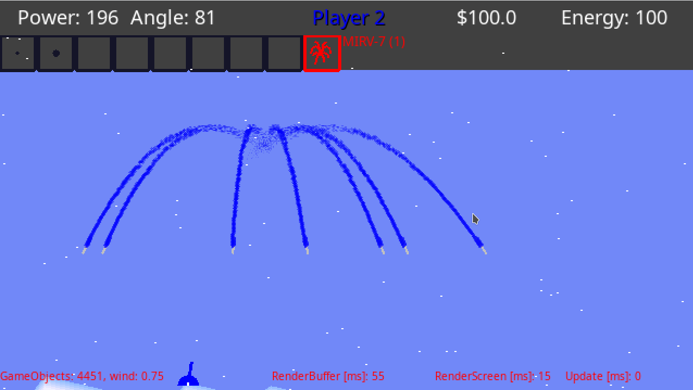

# HersiTanks

HersiTanks is a tiny indie game dev project by me. It is inspired by the classic dos-based game, TankWars (aka. BOMB). It is meant as a recreational hobby project for me to get used to Kotlin. And to make Hersi happy, because he loves TankWars.

> 

> 

> 

> 

> 

> 

> 

Jesus loves you!